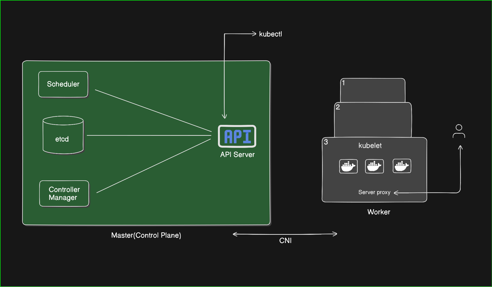

# Kubernetes Complete Theory 🚀

This repository contains my Kubernetes learning notes including:
- Kubernetes Architecture
- Core Components
- Pods, Deployments, Services
- Networking & Security
- Interview Questions

📌 Created for learning + interview preparation.

## My Diagram

